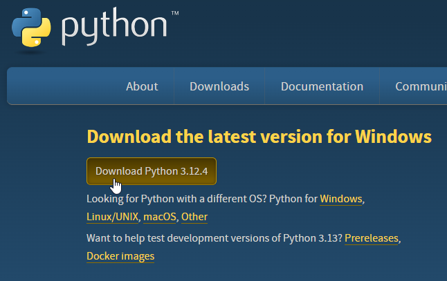
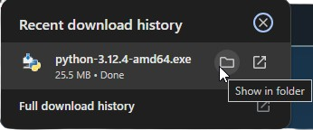
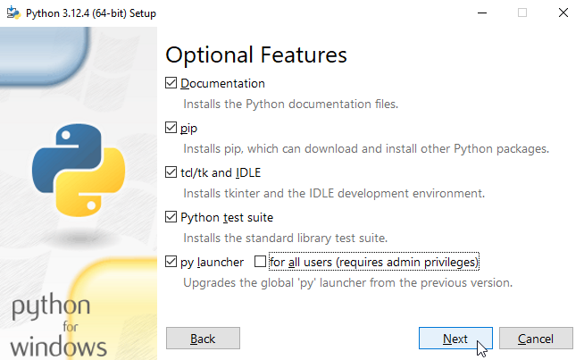
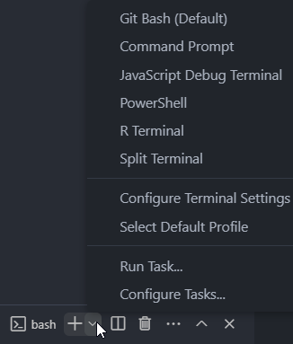

# Zero to Hero: Academic to Pro

# 1. Introduction
## 1.1 Background
When I graduated in math and physics, I had some [Python](https://www.python.org/) experience, but only in a research context. I needed to shift my thinking to a more computational approach. I realized that strong software skills could help solve complex problems. I found [Project Euler](projecteuler.net), a website focused on solving progressively challenging math problems with code, and thought it was the perfect place to start. Later, I found [LeetCode](https://leetcode.com/) was also crucial for improving.

## 1.2 Purpose
After six years as a professional developer, I've added the tools, tips, and tutorials I wish I'd had when I started. This repository walks through the basics of interfacing with the computer as a software developer while also solving [LeetCode](https://leetcode.com/) and [Project Euler](projecteuler.net) problems. If you're strong in math but need to improve your Python skills, this repository is for you.

# 2. Environment Setup 
If you've used [R](https://www.r-project.org/) or [Python](https://www.python.org/) in research, you may have used [Anaconda](https://www.anaconda.com/) to simplify setup, package installation, and writing prototype code. However, staying in this tutorial zone can limit you. Learning to set up Python and interact with your computer's filesystem is crucial foundational knowledge, even if it's frustrating at first.

## 2.1 Python
First, visit the [downloads section](https://www.python.org/downloads/) of the official Python website and download the latest version of the Python installer for Windows.
# 
Unless you have a specific reason to use something older use the latest version (e.g. TensorFlow is [incompatible with Python > 3.11](https://www.tensorflow.org/install) as of writing this). Does this mean if we want to use TensorFlow, we have to uninstall the latest version of Python? No. We can use different Python versions for different projects, but we'll tackle that a little later.

Go to wherever you downloaded the installer, then run it.
# 
# 
The **☑ Add python.exe to PATH** option during installation configures your Windows system to recognize Python commands from *any* command prompt.
# 
The only people who need to install Python globally work in IT. Even if you're on a company laptop, just install Python for yourself.
# 
The **☑ Add Python to Environment Variables** option is equivalent to **☑ Add python.exe to PATH**. We want to set up the system's environment variables to include the directory where Python is installed.

Again, this allows the operating system to locate Python executables and scripts from *any* command line or terminal without needing to specify the full path (i.e. `C:\Users\Cemenenkoff\AppData\...\python.exe`). Instead, we can access Python by simply typing `python` in the shell.

# 
After installation, we can verify Python is correctly installed by opening Command Prompt and typing `python --version`, which should display the installed version of Python.

# 

## 2.2 Git Bash  
Instead of [Command Prompt](https://learn.microsoft.com/en-us/windows-server/administration/windows-commands/windows-commands) or [PowerShell](https://learn.microsoft.com/en-us/windows-server/administration/windows-commands/powershell), I prefer using [Git Bash](https://git-scm.com/) because it is cross-platform and designed for Git, the near-ubiquitous version control system. Download the [latest stable build](https://git-scm.com/download/win) and install with the recommended settings.

## 2.3 Notepad++ 
[Notepad++](https://notepad-plus-plus.org/) is a widespread, open source upgrade to Microsoft's default Notepad. If we were to code Python in a bare bones text editor, Notepad++ would be a logical choice. It has a myriad of plug-ins and customizability, and it directly interfaces with Git Bash, our preferred terminal. Download the [latest stable build](https://notepad-plus-plus.org/downloads/) and install with the recommended settings.

## 2.4 VS Code 
[VS Code](https://code.visualstudio.com/) is the natural code editor for the modern developer. Download the [latest stable build](https://code.visualstudio.com/). Old school coding veterans often prefer text editors like [VIM](https://www.vim.org/) or [Emacs](https://www.gnu.org/software/emacs/) that offer customization, efficiency, and speed at the expense of modern GUI and a gentler learning curve.

### 2.2.1 The Integrated Terminal
VS Code has a **built-in terminal** that allows us to run command-line operations without needing to switch windows. Be sure to set the default integrated terminal to `bash`.

# 

### 2.2.2 Hotkeys
Using hotkeys is the key to making coding feel comfortable and natural. It's essential to **automate your workflow**, and the less you have to move the mouse, the better your wrists will feel. Some of the most useful to begin with are
| Shortcut                 | Action                               |
|--------------------------|--------------------------------------|
| `Ctrl` + `A`             | Select All                           |
| `Ctrl` + `C`             | Copy                                 |
| `Ctrl` + `V`             | Paste                                |
| `Ctrl` + `D`             | Add Selection to Next Find Match     |
| `Ctrl` + `O`             | File: Open File...                   |
| `Ctrl` + `K` `Ctrl` + `O`| File: Open Folder...                 |
| `Shift` + `Alt` + `R`    | File: Reveal in File Explorer        |
| `Ctrl` + `F`             | Find                                 |
| `Ctrl` + `H`             | Replace                              |

### 2.2.3 The Debugger
In a professional context, the debugger is crucial for solving bugs. While print statements have their place, the debugger is the *most* important tool for identifying errors.

Like the built-in terminal, VS Code has a **built-in debug console**. When running a script in debug mode, you can explore variable states and the call stack when paused at a breakpoint.

By default, VS Code creates a new terminal for each debug run. This can consume unnecessary RAM, especially for new programmers who don't need previous debug outputs. To avoid this, configure VS Code to send output to the integrated debug console, clearing history after each run. This setting is managed in something called the `launch.json` file that appears in the dynamically-generated `.vscode` folder when prompted. [Here is the standard one I use](.vscode/launch.json).

```python
{
    // Use IntelliSense to learn about possible attributes.
    // Hover to view descriptions of existing attributes.
    // For more information, visit: https://go.microsoft.com/fwlink/?linkid=830387
    "version": "0.2.0",
    "configurations": [
        {
            "name": "Python Debugger: Current File",
            "type": "debugpy",
            "request": "launch",
            "program": "${file}",
            "console": "internalConsole",
            "internalConsoleOptions": "openOnSessionStart"
        }
    ]
}
```
### 2.2.4 Extensions for Quality of Life
### Core Extensions for an Enhanced VS Code Experience

After years of coding, I find these core extensions greatly enhance the VS Code experience:

1. **[One Dark Pro](https://github.com/Binaryify/OneDark-Pro) by binaryify**
   - This theme's syntax highlighting and clever use of italics ease frustration by making code more readable.

2. **[Material Icon Theme](https://marketplace.visualstudio.com/items?itemName=PKief.material-icon-theme) by Phillipp Kief**
   - Uses colored icons to simplify finding different file types in repositories with various supplemental files and directories.

3. **[Markdown All in One](https://marketplace.visualstudio.com/items?itemName=yzhang.markdown-all-in-one) by Yu Zhang**
   - Allows editing and previewing Markdown documentation directly in VS Code, streamlining the documentation workflow.

4. **[Markdown PDF](https://github.com/yzane/vscode-markdown-pdf) by yzane**
   - Converts Markdown documents into PDF format with ease.

5. **[Rainbow CSV](https://marketplace.visualstudio.com/items?itemName=mechatroner.rainbow-csv) by mechatroner**
   - Makes reading comma-separated values directly in VS Code possible, eliminating the need for Excel.

6. **[vscode-pdf](https://marketplace.visualstudio.com/items?itemName=tomoki1207.pdf) by tomoki1207**
   - Enables viewing PDF files directly in VS Code, reducing context switching.

7. **[Python Indent](https://marketplace.visualstudio.com/items?itemName=KevinRose.vsc-python-indent) by Kevin Rose**
   - Automatically indents Python code to the correct level according to [PEP 8 standards](https://peps.python.org/pep-0008/#indentation), improving readability without distraction.

8. **[RUFF](https://astral.sh/ruff) by Astral Software**
   - Automatically formats Python code in modern Black-style, eliminating the need for manual formatting.

9. **[isort](https://github.com/microsoft/vscode-isort) by Microsoft**
   - Consistently sorts imports, enhancing code readability. Combined with RUFF, it auto-formats most elements of Python scripts.

10. **[autoDocstring: VSCode Python Docstring Generator](https://marketplace.visualstudio.com/items?itemName=njpwerner.autodocstring) by Nils Werner**
    - Dynamically creates Google-style docstrings based on a function's definition, saving significant time.

### 2.2.5 Customizing User Settings
### 2.2.6 Automated Style and Formatting

## 2.3 Virtual Environments
### 2.3.1 Global vs. Local Workspaces
### 2.3.2 Managing Dependencies
#### 2.3.3 `pip-tools` and `requirements.txt`
##### 2.3.3.1 `pip freeze > requirements.in`
##### 2.3.3.2 `pip-compile`

## 2.4 Git and Version Control
### 2.4.1 Basic Git Workflow

## 2.5 Organizing Your Workspace
### 2.5.1 Organizing the File Explorer
### 2.5.2 Code vs. Non-Code Files
### 2.5.3 Supplemental Files