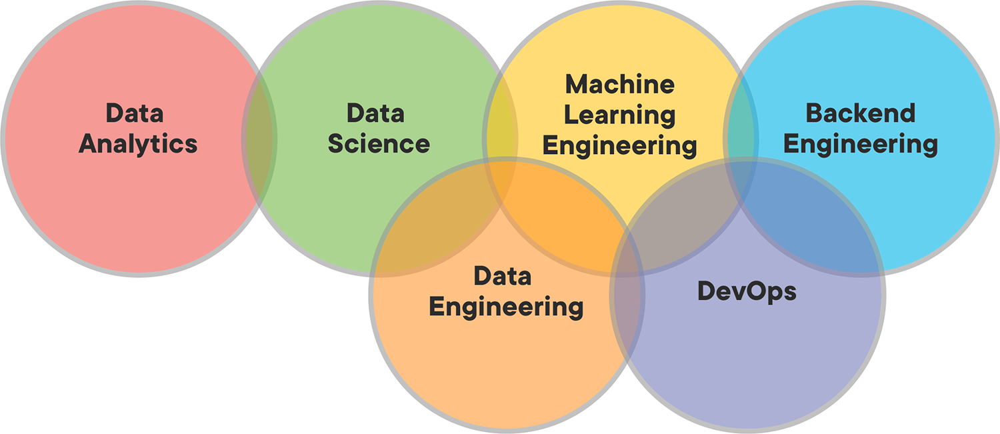
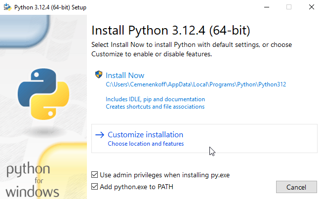
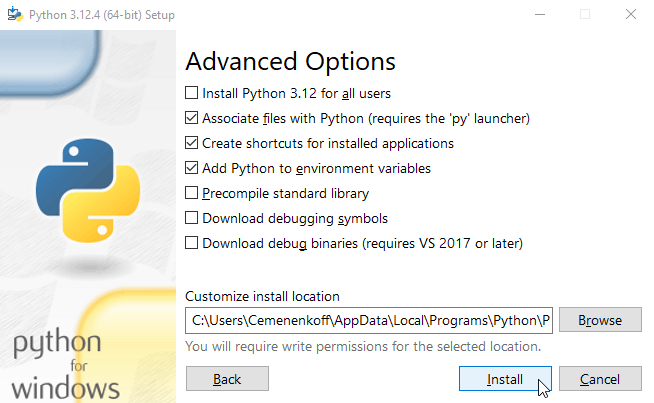
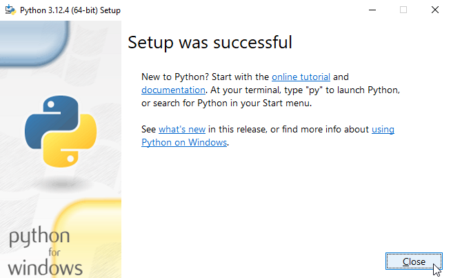
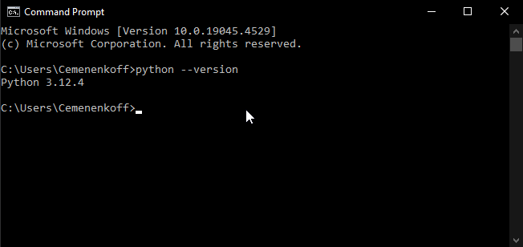
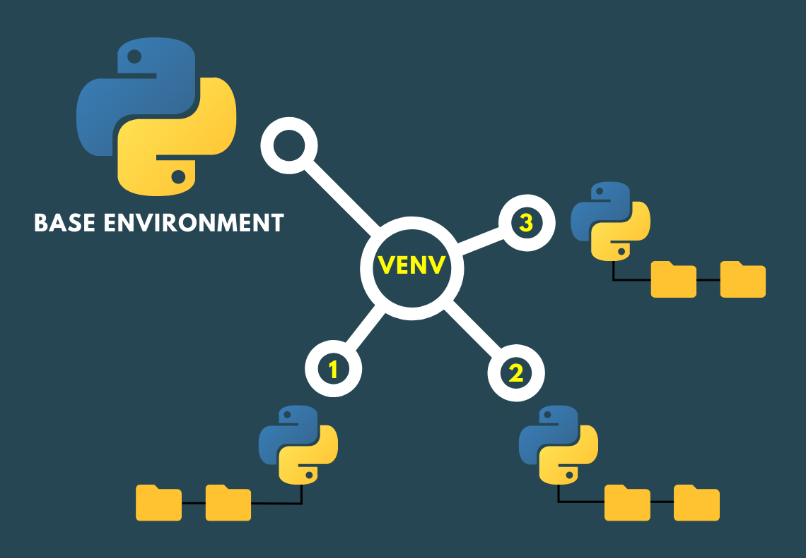
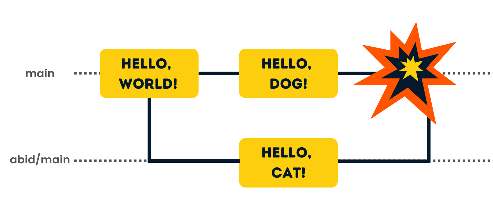

<p align="center">
  
</p>

<h1 style="text-align: center;">Python Essentials for STEM Wizards</h1>

<p align="center">
  
</p>

<!-- TOC start (generated with https://github.com/derlin/bitdowntoc) -->

- [1. Introduction (to the Job Market)](#1-introduction-to-the-job-market)
  - [1.1 Purpose](#11-purpose)
  - [1.2 Background](#12-background)
- [2. Environment Setup ](#2-environment-setup-)
  - [2.1 Python ](#21-python-)
  - [2.2 Git Bash  ](#22-git-bash--)
  - [2.3 Notepad++ ](#23-notepad-)
  - [2.4 VS Code ](#24-vs-code-)
    - [2.4.1 The Integrated Terminal](#241-the-integrated-terminal)
    - [2.4.2 Hotkeys](#242-hotkeys)
    - [2.4.3 The Debugger](#243-the-debugger)
    - [2.4.4 Extensions for Quality of Life](#244-extensions-for-quality-of-life)
    - [2.4.5 Automated Style and Formatting](#245-automated-style-and-formatting)
      - [2.4.5.1 The Black Formatter](#2451-the-black-formatter)
    - [2.4.6 Customizing User Settings](#246-customizing-user-settings)
  - [2.5 Virtual Environments](#25-virtual-environments)
    - [2.5.1 Global vs. Local Workspaces](#251-global-vs-local-workspaces)
    - [2.5.2 Creating a Virtual Environment](#252-creating-a-virtual-environment)
    - [2.5.3 Managing Dependencies](#253-managing-dependencies)
      - [2.5.3.1 Managing Interlaced Dependencies](#2531-managing-interlaced-dependencies)
- [3. Git and Version Control](#3-git-and-version-control)
  - [3.1 Basic Git Overview](#31-basic-git-overview)
  - [3.2 General Strategy to Git Development](#32-general-strategy-to-git-development)
  - [3.3 Usual Git Workflow](#33-usual-git-workflow)
  - [3.4 Dealing with Merge Conflicts](#34-dealing-with-merge-conflicts)
    - [***Before starting work, always*** `git pull`.](#before-starting-work-always-git-pull)
- [4. Organizing Your Workspace](#4-organizing-your-workspace)
  - [4.1 Organizing the File Explorer](#41-organizing-the-file-explorer)
  - [4.2 Naming Conventions](#42-naming-conventions)
  - [4.3 Supplemental Files](#43-supplemental-files)
- [5. Conclusion](#5-conclusion)
  - [5.1 Where to Go from Here?](#51-where-to-go-from-here)

<!-- TOC end -->

<!-- TOC --><a name="1-introduction-to-the-job-market"></a>
# 1. Introduction (to the Job Market)


***This repository is for STEM graduates who want to become software professionals.*** It's designed for those who excel in science, statistics, or data analysis but have knowledge gaps in software engineering. If you're great academically but less great with coding, this repo is perfect for you no matter what data-based job you're aiming for.

<!-- TOC --><a name="11-purpose"></a>
## 1.1 Purpose
After six years as a professional developer, I've returned to this practice repo and enhanced it with the tools, tips, and tutorials I wish I'd have been given when starting out. This repository covers the essentials of ***interfacing with the computer as a software developer*** while practicing with [LeetCode](https://leetcode.com/) and [Project Euler](projecteuler.net). It's designed to help you improve your computer skills, especially if you have a strong math background.

Please note, this repository does *not* focus on creating elaborate data science projects or complex machine learning models. Instead, it emphasizes the engineering principles and efficient data structures essential for developing robust, high-performance software.

<!-- TOC --><a name="12-background"></a>
## 1.2 Background
After graduating with degrees in math and physics, I had only used [Python](https://www.python.org/) in a research setting. My clunky code was holding me back. I needed to adopt a more computational approach to break new ground (e.g. a one-month runtime is unreasonable). I realized that deepening my understanding of software principles was key to solving more complex numerical problems. I then discovered [Project Euler](projecteuler.net), a website focused on solving progressively challenging math problems with code. It was the perfect place to start. Later, I found that [LeetCode](https://leetcode.com/) was also crucial for improving, as it reinforces coding with efficient, industry-standard data structures.

<!-- TOC --><a name="2-environment-setup"></a>
# 2. Environment Setup 
If you've used [R](https://www.r-project.org/) or [Python](https://www.python.org/) in research, you may have used [Anaconda](https://www.anaconda.com/) to simplify setup and package installation to jump right into coding. Staying in this tutorial zone limits your growth and ability to **push to production**. Learning to set up Python and interact with your computer's filesystem is crucial foundational knowledge, even if it's frustrating at first.

<!-- TOC --><a name="21-python"></a>
## 2.1 Python 
First, visit the [downloads section](https://www.python.org/downloads/) of the official Python website and download the latest version of the Python installer for Windows.


Unless you have a specific reason to use something older, use the latest version (e.g. TensorFlow is [incompatible with Python > 3.11](https://www.tensorflow.org/install) as of writing this). Does this mean if you want to use TensorFlow, you have to uninstall the latest version of Python? No. You can use different Python versions for different projects, but that will be covered a little later.

Go to wherever you downloaded the installer, then run it.



The **☑ Add python.exe to PATH** option during installation configures your Windows system to recognize Python commands from *any* command prompt.


The only people who need to install Python globally work in IT. Even if you're on a company laptop, just install Python for yourself.



The **☑ Add Python to Environment Variables** option is the same as **☑ Add python.exe to PATH**. This sets up the system's [environment variables](https://kinsta.com/knowledgebase/what-is-an-environment-variable/) to include the directory where Python is installed.

This setup allows the operating system to locate Python executables and scripts from any command line or terminal without specifying the full path (e.g. `C:\Users\..\python.exe`). Instead, you can access Python by simply typing `python` in your chosen terminal.



After setup, verify that the installation was successful by opening Command Prompt and running `python --version`.



<!-- TOC --><a name="22-git-bash"></a>
## 2.2 Git Bash  
Instead of [Command Prompt](https://learn.microsoft.com/en-us/windows-server/administration/windows-commands/windows-commands) or [PowerShell](https://learn.microsoft.com/en-us/windows-server/administration/windows-commands/powershell), I prefer using [Git Bash](https://git-scm.com/) because it is cross-platform and designed for [Git](https://en.wikipedia.org/wiki/Git), the near-ubiquitous version control system. Download the [latest stable build](https://git-scm.com/download/win) and install it with the default recommended settings.

<!-- TOC --><a name="23-notepad"></a>
## 2.3 Notepad++ 
[Notepad++](https://notepad-plus-plus.org/) is a widespread, open source upgrade to Microsoft's default [Notepad](https://en.wikipedia.org/wiki/Windows_Notepad). If you were to code in Python in a bare bones text editor, Notepad++ would be a logical choice. It has a clean GUI and a myriad of plug-ins and customizability, and it directly interfaces with Git Bash. Download the [latest stable build](https://notepad-plus-plus.org/downloads/) and install it with the default recommended settings.

<!-- TOC --><a name="24-vs-code"></a>
## 2.4 VS Code 
[VS Code](https://code.visualstudio.com/) is *the* best code editor for the modern developer on a Windows machine. It is free, open-source, lightweight, cross-platform, fast, customizable, widely used, and equipped with all modern coding tools in the same interface. Download the [latest stable build](https://code.visualstudio.com/) and install it with the default settings.

<!-- TOC --><a name="241-the-integrated-terminal"></a>
### 2.4.1 The Integrated Terminal
VS Code has a **built-in terminal** that allows you to run command-line operations without needing to switch windows. ***Be sure to set the default integrated terminal to Git Bash***.

<p align="left">
  
</p>

<!-- TOC --><a name="242-hotkeys"></a>
### 2.4.2 Hotkeys
Hotkeys are the way to making coding feel comfortable and natural. It's essential to **automate your workflow**, and the less you have to move the mouse, [the better your wrists will feel](https://x-team.com/blog/avoid-carpal-tunnel-syndrome).

VS Code is fully accessible from the keyboard. The most important key combination to know is `F1`, which brings up the Command Palette. From there, you have access to all functionality within VS Code, including keyboard shortcuts for the most common operations. Here are some of the most useful ones for beginners.

| Shortcut                 | Action                               |
|--------------------------|--------------------------------------|
| `F1`                     | Open Command Palette                 |
| `Ctrl` + `/`             | Toggle Line Comment                  |
| `Shift` + `Alt` + `↑`    | Copy Line Up (or Down `↓`)           |
| `Alt` + `←`              | Go Back (or Forward `→`)             |
| `Alt` + `↑`              | Move Line Up (or Down `↓`)           |
| `Ctrl` + `D`             | Add Selection to Next Find Match     |
| `Ctrl` + `X`             | Cut (the Entire Line)                |
| `Ctrl` + `K` `Ctrl` + `O`| File: Open Folder...                 |
| `Shift` + `Alt` + `R`    | File: Reveal in File Explorer        |
| `Ctrl` + `F`             | Find                                 |
| `Ctrl` + `H`             | Replace                              |
| `F5`                     | Debug: Start Debugging               |
| `F12`                    | Go to Definition                     |

<!-- TOC --><a name="243-the-debugger"></a>
### 2.4.3 The Debugger
In a professional context, the [debugger](https://code.visualstudio.com/docs/editor/debugging) is *crucial* for solving bugs. While print statements have their place, ***the debugger is the most important tool for identifying critical issues or production bugs***.

Like the built-in terminal, VS Code has a **built-in debug console**. When running a script with the debugger, you can explore variable states and the [call stack](https://en.wikipedia.org/wiki/Call_stack) when paused at a [breakpoint](https://en.wikipedia.org/wiki/Breakpoint).

By default, VS Code creates a *new* terminal for each debug run. This can consume unnecessary RAM, especially for new programmers who don't need previous debug outputs. To avoid this, configure VS Code to send output to the integrated debug console, clearing history after each run. This setting is managed in something called the `launch.json` file that appears in the dynamically-generated `.vscode` folder when debugging is prompted (with `F5`). [Here is the standard one I use](.vscode/launch.json).

```python
{
    // Use IntelliSense to learn about possible attributes.
    // Hover to view descriptions of existing attributes.
    // For more information, visit: https://go.microsoft.com/fwlink/?linkid=830387
    "version": "0.2.0",
    "configurations": [
        {
            "name": "Python Debugger: Current File",
            "type": "debugpy",
            "request": "launch",
            "program": "${file}",
            "console": "internalConsole",
            "internalConsoleOptions": "openOnSessionStart"
        }
    ]
}
```
<!-- TOC --><a name="244-extensions-for-quality-of-life"></a>
### 2.4.4 Extensions for Quality of Life

After years of coding, I find these core extensions greatly enhance the VS Code experience.

1. **[One Dark Pro](https://github.com/Binaryify/OneDark-Pro) by binaryify**
   - This theme's syntax highlighting and clever use of italics ease frustration by making code more readable.

2. **[Material Icon Theme](https://marketplace.visualstudio.com/items?itemName=PKief.material-icon-theme) by Phillipp Kief**
   - This theme enhances the VS Code file explorer with colored icons, making file searching simpler.

3. **[Markdown All in One](https://marketplace.visualstudio.com/items?itemName=yzhang.markdown-all-in-one) by Yu Zhang**
   - This extension allows for editing and previewing Markdown documentation directly in VS Code, streamlining documentation workflow.

4. **[Markdown PDF](https://github.com/yzane/vscode-markdown-pdf) by yzane**
   - Convert Markdown documents into PDF format with ease if you ever need to email a report.

5. **[Rainbow CSV](https://marketplace.visualstudio.com/items?itemName=mechatroner.rainbow-csv) by mechatroner**
   - Rainbow CSV makes reading comma-separated values directly in VS Code possible, reducing time spent context switching (to Excel 😖).

6. **[vscode-pdf](https://marketplace.visualstudio.com/items?itemName=tomoki1207.pdf) by tomoki1207**
   - With this, you can view PDF files directly in VS Code, reducing context switching.

7. **[Python Indent](https://marketplace.visualstudio.com/items?itemName=KevinRose.vsc-python-indent) by Kevin Rose**
   - This extension automatically indents Python code to the correct level as you write new lines, reducing keystrokes and improving readability without distraction.

8. **[Ruff](https://astral.sh/ruff) by Astral Software**
   - Automatically format your Python code in modern [Black](https://github.com/psf/black) style, practically eliminating the need for manual formatting. I also recommend adding these keyboard shortcuts for Ruff formatting:
    

9. **[isort](https://github.com/microsoft/vscode-isort) by Microsoft**
   - This extension consistently sorts imports, enhancing code readability. Combined with Ruff, you can auto-format nearly everything in your Python scripts except for some comments and docstrings.
10. **[autoDocstring: VSCode Python Docstring Generator](https://marketplace.visualstudio.com/items?itemName=njpwerner.autodocstring) by Nils Werner**
    -  Dynamically create [Google-style docstrings](https://google.github.io/styleguide/pyguide.html) based on a function's definition. This gives you that last piece of formatting automation.

<!-- TOC --><a name="245-automated-style-and-formatting"></a>
### 2.4.5 Automated Style and Formatting
***Spend as little time on formatting as possible.*** Using Ruff, isort, and autoDocstring eliminates 99% of any formatting you'll need to do. Solving the problem at hand should always be your main focus.

<!-- TOC --><a name="2451-the-black-formatter"></a>
#### 2.4.5.1 The Black Formatter
> *"[Black](https://github.com/psf/black) is an uncompromising Python code formatter that saves time and mental energy by automating code formatting, ensuring consistency, and reducing diffs for faster code reviews."*

The Black formatting standard is a modern improvement to the previous one, [PEP 8](https://peps.python.org/pep-0008/), and it's *the best* modern way to format a Python code base. The Ruff extension utilizes Black when it performs automated formatting.

<!-- TOC --><a name="246-customizing-user-settings"></a>
### 2.4.6 Customizing User Settings
Black defaults to [88 characters per line](https://black.readthedocs.io/en/stable/the_black_code_style/current_style.html#line-length) while PEP8 uses between [72 and 99 characters](https://peps.python.org/pep-0008/#maximum-line-length). Keeping all of this in mind, I configured my user settings to include highlighting certain line lengths (i.e. rulers) and wrapping text at 88 characters. [Here is a link to the user `settings.json` file I use while developing](config/settings.json).

Note that these settings are *user* settings, so they must be set by accessing **Preferences: Open User Settings (JSON)** from the command palette. Remember, `F1` opens the command palette.


After the user `settings.json` file is open, you can copy-and-paste my settings file, but note that ***it assumes all previously-mentioned extensions are installed***.

<!-- TOC --><a name="25-virtual-environments"></a>
## 2.5 Virtual Environments
Virtual environments are *essential* for managing project dependencies. They allow you to avoid the hassle of reinstalling Python multiple times when different projects require different versions (e.g., Python 3.8 vs. 3.12).

<!-- TOC --><a name="251-global-vs-local-workspaces"></a>
### 2.5.1 Global vs. Local Workspaces

In a **global workspace**, Python packages are installed system-wide. While convenient for system tools and widely used libraries, this approach can lead to version conflicts and unintended updates across projects.

A **local workspace**, on the other hand, utilizes virtual environments to isolate project-specific dependencies. By creating a virtual environment for each project, you can install packages without affecting the system-wide Python installation. This isolation ensures that each project operates with its own set of dependencies, maintaining consistency and stability.

Local workspaces allow you to experiment with different package versions too, helping facilitate updating project **dependencies** (which can be a very frustrating process).

<!-- TOC --><a name="252-creating-a-virtual-environment"></a>
### 2.5.2 Creating a Virtual Environment
Once your workspace folder is open, do the following.
1. Run `pip install virtualenv`.
   1. What is `pip install`?
      1. In Python, `pip` stands for "Pip Installs Packages" and it's the default package installer for Python. It's used to install packages from the [Python Package Index (PyPI)](https://pypi.org/). `install` is just one of the many commands available, and you can use `pip help` to see a list of all available commands.
   2. What is `virtualenv`?
      1. [`virtualenv`](https://virtualenv.pypa.io/en/latest/) is a package for setting up virtual environments. While Python *does* already have a package that does this called `venv`, it is *only* compatible with Python >= 3.3, whereas `virtualenv` runs on a wider range of versions, plus offers additional features for more complex development environments.
2. Run `virtualenv venv`.
   1. This creates a virtual environment folder named `venv` in your workspace folder. It contains a sequestered installation of Python (and the version can be specified with the `--python=python3.x` flag).
3. Run `source venv/Scripts/activate`.
   1. This command runs a BAT ("batch") file (batch files are automation scripts file for Windows) that sets up and activates the environment.
4. After the environment is activated, you should see `(venv)` above the first line of the terminal.

<p align="center">
  
</p>

5. At this point, you have a blank slate to begin installing packages. If you are running someone else's project, they should have a `requirements.txt` file that lists out all modules necessary to get the software to work. To install these all in one go, run `pip install -r requirements.txt`.

<!-- TOC --><a name="253-managing-dependencies"></a>
### 2.5.3 Managing Dependencies
What if you want to make your own `requirements.txt` file? As your projects grow more complex, you'll need to import various Python libraries, each potentially requiring specific versions of *their* own dependencies. Without a proper system to manage these interconnected dependencies, things can quickly become a mess. The standard way to export currently-installed modules is with `pip freeze > requirements.txt`, but there is a better way.

<!-- TOC --><a name="2531-managing-interlaced-dependencies"></a>
#### 2.5.3.1 Managing Interlaced Dependencies
By default, running `pip freeze > requirements.txt` exports a list of your project dependencies in a file named `requirements.txt`. For a project with four dependent modules, the results might look like this:

```
build==1.2.1
click==8.1.7
colorama==0.4.6
contourpy==1.2.1
```

However, ***this list doesn't indicate which modules depend on which others***.

This is where `pip-tools` becomes useful. After installing the package with `pip install pip-tools`, the flow to export dependencies becomes:
1. `pip freeze > requirements.in`
2. `pip-compile`

The resulting `requirements.txt` file includes not only the required modules and their versions, but also all of their interlaced dependencies. This detailed information is especially valuable when sharing code with other developers that want to update or modify dependencies in your project.

```
# This file is autogenerated by pip-compile with Python 3.12
# by the following command:
#
#    pip-compile
#
build==1.2.1
    # via
    #   -r requirements.in
    #   pip-tools
cfgv==3.4.0
    # via
    #   -r requirements.in
    #   pre-commit
click==8.1.7
    # via
    #   -r requirements.in
    #   pip-tools
colorama==0.4.6
    # via
    #   -r requirements.in
    #   build
    #   click
contourpy==1.2.1
    # via
    #   -r requirements.in
    #   matplotlib
```

<!-- TOC --><a name="3-git-and-version-control"></a>
# 3. Git and Version Control
[Not using Git is a recipe for disaster](https://www.reddit.com/r/git/comments/uoz748/how_to_cooperate_with_people_that_dont_use_git/). Developing enterprise software is complex, and tracking progress is essential. While there are various methods for version control (e.g., `myscript.py`,` myscript1.py`, `myscript1_final.py`), Git is by far the best. Although new developers may find Git intimidating at first, embracing it early on saves considerable pain and frustration in the long run.

<!-- TOC --><a name="31-basic-git-overview"></a>
## 3.1 Basic Git Overview
Watch [this video by ByteByteGo](https://www.youtube.com/watch?v=e9lnsKot_SQ) for a great overview of Git.

<p align="center">
  
</p>

The ***four main areas*** Git interfaces with are:
1. **/localWorkingDir**
2. **Staging Area**
3. **Local Repository**
4. **Remote Repository**

The commands you'll use 99% of the time are:
- `git clone`
  - Create a copy of an existing repository from a remote server to your local machine.
- `git branch`
  - List, create, or delete branches within a repository.
- `git checkout`
  - Switch between branches or restore files in the working directory.
- `git add`
  - Stage changes (new, modified, or deleted files) to be included in the next commit.
- `git commit`
  - Record any staged changes to the repository with a descriptive message.
- `git push`
  - Upload local commits to a remote repository.
- `git pull`
  - Fetch and integrate changes from a remote repository into the current branch.

Less often, you'll need additional commands when managing a complex code base. [This video by ByteByteGo](https://www.youtube.com/watch?v=0chZFIZLR_0) is a great introduction to them.

<p align="center">
  
</p>

- `git merge`
  - Combine changes from one branch into another, creating a merge commit that integrates the histories of both branches.
- `git rebase`
  - Move or re-apply a series of commits to a new base commit, creating a linear project history.
- `squash commit`
  - Combine multiple commits into a single commit, simplifying the commit history. This can be done during a rebase or merge.

<!-- TOC --><a name="32-general-strategy-to-git-development"></a>
## 3.2 General Strategy to Git Development
After cloning a project and aunthenticating, you want to have a cohesive general approach to developing new features in your repo.
1. 💾 ***Commit frequently.*** You want to maintain a clean commit history by committing frequently, logically chunking updates with meaningful commit messages. This makes reading the commit history much easier.
2. ❌ ***Avoid partial pushes.*** Only push to remote when your work is ready, and avoid partial pushes. This is an essential practice to prevent bugs in production.
3. 🌱 ***Develop on new branches.*** To make sure things don't get mixed up, its best to develop new features or bugfixes on new branches. Working solely on `master` is only really appropriate when you're the sole author of a project, and even still, creating new branches for particularly large feature changes saves a lot of headache if anything ever needs to be rolled back, even if you are working alone.

<!-- TOC --><a name="33-usual-git-workflow"></a>
## 3.3 Usual Git Workflow
Here's how my standard development process looks on a daily basis. Again, `merge` or `rebase` aren't used often, so they aren't a part of this flow.
1. 📥 Clone the repository from its remote location to your local machine.
   1. `git clone <url>`
      1. This can be done with SSH or HTTPS. SSH saves time in the long run and could be considered slightly more secure, but both methods are just fine.
2. 🌱 Make a new branch and switch to it.
   1. `git branch <name>` to create the branch.
   2. `git checkout <name>` to switch to it.
   3. *Or*, use `git checkout -b <name>` to do it all at once (this is the easiest way).
3. 📝 Make changes locally by creating new files or editing existing ones.
4. 📨 Add the changes to the Staging Area.
   1. `git add .`
      1. Note that `.` means *all* files, but you could specify individual ones with `git add "myfile.txt"` if you wanted.
5. 📬 Commit the changes with a *meaningful* message (easier said than done).
   1. `git commit -m "asdf"`
6. Repeat steps 3-5 for subsequent changes, paced at logical intervals.
7. 📤 Push all commits to the remote repository.
   1. `git push`
8. To learn even more, [MIT provides an in-depth guide to learning the Git workflow](https://ocw.mit.edu/ans7870/6/6.005/s16/getting-started/#git).

<!-- TOC --><a name="34-dealing-with-merge-conflicts"></a>
## 3.4 Dealing with Merge Conflicts



Before you're a professional, you'll almost never collaborate with other devs on a coding project in the same repo, so merge conflicts are rare. However, once multiple team members begin working on the same codebase simultaneously, it can get messy.

For instance, what happens if a colleague pushes a series of commits while you're in the middle of developing a feature? This situation calls for merging the changes, which is typically straightforward if they involve separate files. If the changes are in the same file however, merge conflicts can be created, and they need *tedious manual review* to resolve.

To avoid all of this headache:
<!-- TOC --><a name="before-starting-work-always-git-pull"></a>
### ***Before starting work, always*** `git pull`.

This way, you are always working from the latest version of your code base, and you're be less likely to have to perform a merge later.

<!-- TOC --><a name="4-organizing-your-workspace"></a>
# 4. Organizing Your Workspace
Adopting virtual environments, Git, and a well-structured folder tree ***streamlines your workflow and reduces errors***. These practices are *foundational* for maintaining a clean, manageable, and scalable codebase, so its essential to practice them, even on personal projects.

<!-- TOC --><a name="41-organizing-the-file-explorer"></a>
## 4.1 Organizing the File Explorer
Most Python projects have similarly-named directories to organize files in a way that is logical and familiar to other devs. The following table lists some of the most common directory names.

| Directory   | Description                                           |
|-------------|-------------------------------------------------------|
| `doc`       | Documentation                                         |
| `img`       | Images                                                |
| `src`       | Source code                                           |
| `venv`      | Virtual environment                                   |
| `tests`     | Unit tests                                            |
| `bin`       | Executables                                           |
| `lib`       | Additional non-pip-installable dependencies           |
| `config`    | Configuration files                                   |
| `notebooks` | Interactive documentation                             |
| `examples`  | Examples of how to use the project                    |
| `queries`   | SQL queries for fetching data                         |
| `static`    | CSS, JavaScript, and images for web apps              |
| `templates` | HTML templates for web apps                           |
| `logs`      | Logs generated by the app                             |
| `scripts`   | Various utility or setup scripts                      |
| `dist`      | Stores distribution packages for the project (i.e. wheels) |
| `build`     | Build-related files and temporary build artifacts     |

Even if these names or concepts aren't familiar yet, using these folders when creating a workspace structure will ***help other devs understand your project***.

<!-- TOC --><a name="42-naming-conventions"></a>
## 4.2 Naming Conventions
In Python, I generally use the following file naming conventions when possible.
1. Directories are lowercase `snake_case`.
2. Non-code files are lowercase `kebab-case`.
3. Classes are `PascalCase`.
4. Functions are lowercase `snake_case`.

A file or directory that uses `kebab-case` can't be directly imported by Python, so I especially like using `kebab-case` for non-code files to reinforce this idea.

<!-- TOC --><a name="43-supplemental-files"></a>
## 4.3 Supplemental Files
According to me, ***every repository worth its salt needs to have the following files:***
- `.gitignore`
  - A configuration file specifies files and directories that Git should ignore. It ensures that sensitive or unnecessary files (e.g. log files or compiled binaries) are not tracked by version control.
- `README.md`
  - A Markdown file that serves as the entry point and documentation for a project. It typically includes a description of the project, installation instructions, usage examples, and other relevant information.
- `requirements.in`
  - A text file used with the `pip-compile` tool. It lists the direct dependencies of a project without specifying how they are interconnected. It's used to generate the `requirements.txt` file.
- `requirements.txt`
  - A text file that lists the Python packages (including their specific versions) required for a project. It allows for easy installation of dependencies using `pip install -r requirements.txt`.

As you want to automate your workflow further, you can introduce some of these intermediate configuration files. Although there are many others, most of my serious Python projects have used the following:
- `.flake8`
  - Configuration file for [Flake8](https://flake8.pycqa.org/en/latest/), a tool that checks Python code against style guides (like [PEP 8](https://peps.python.org/pep-0008/)) and detects various programming errors.
- `.gitattributes`
  - Configuration file that specifies attributes for files in a Git repository. It can define attributes such as text/binary handling, merge strategies, and end-of-line normalization.
- `.pre-commit-config.yaml`
  - Configuration file for the [Pre-commit framework](https://pre-commit.com/), which manages and executes hooks for code formatting, linting, and more, ensuring code quality *before* commits. I've found this configuration file to be one of the most important when it comes to reducing diffs and unifying a code base.
    - If this file is implemented into a legacy code base and there are a ton of recommended changes to make (too many to feasibly fix at once), using the `--no-verify` flag bypasses the `pre-commit` checks.
- `pyproject.toml`
  - [TOML](https://toml.io/en/) configuration file that specifies build system requirements, dependencies, and other project metadata. I primarily use it to define settings for the Black code formatter, but also to list dependencies and requirements when designing a repository intended to be a Python [module](https://docs.python.org/3/tutorial/modules.html) itself.

<!-- TOC --><a name="5-conclusion"></a>
# 5. Conclusion
Great job if you've made it this far. This guide has a lot of condensed information, but it will help you code like a professional Python software engineer instead of a university academic. Practicing these principles and workflows alongside coding concepts and data projects is the difference between pushing a project to production or having it sit in a closet as a prototype. [Docker containers](https://www.docker.com/resources/what-container/) are also relevant to this idea, but are outside of the scope of this repo.

<!-- TOC --><a name="51-where-to-go-from-here"></a>
## 5.1 Where to Go from Here?
If you were able to use these concepts to clone or fork this repository, start developing solutions to [Project Euler](https://projecteuler.net/) or [LeetCode](https://leetcode.com/) problems, and ***treat this repo as a gym*** 🏋️. It's a place to show up every day and keep your mind and software skills sharp. Don't just solve problems, but *practice your workflows*, and keep on top of your Github profile. Remember that consistency is key, and strength builds over time. You can't become a wizard in a day.

<p align="center">
  
</p>
